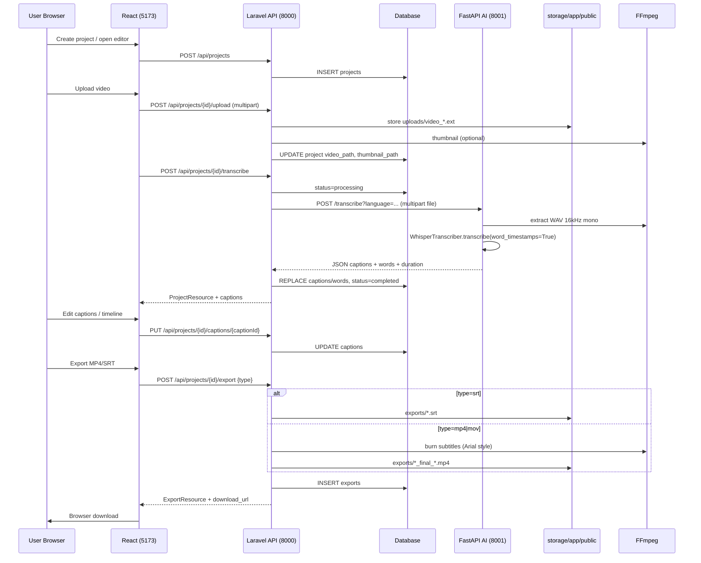

# AutoCaption Studio — Full Project Context (Code-Verified)

**Generated:** 2026-10-06  
**Scope:** `extract_text_app/` (backend Laravel, `ai/` FastAPI, `frontend/` React)  
**Source of truth:** Code over documentation. Prior docs live in `prompts/PROJECT_CONTEXT.md` and `prompts/project_context.txt` (not in `docs/`).

---

## 1. Overview

### What the app does

AutoCaption Studio is a local three-tier app for **video upload → AI transcription → caption editing → export (SRT or burned-in MP4)**. The intended flow:

1. User creates a project (Laravel API + MySQL/SQLite).
2. User uploads a video to Laravel (`storage/app/public/uploads/`).
3. Laravel calls the FastAPI service (`POST /transcribe`) with the video file; FastAPI extracts 16 kHz mono WAV via FFmpeg, runs **faster-whisper** with word timestamps, returns JSON segments.
4. Laravel persists `captions` and `words`, sets project `status` to `completed`.
5. React editor loads project + captions, previews subtitles on a custom video player, edits text/timing via API, optional client-only style overrides.
6. Export: Laravel writes SRT to public disk or runs FFmpeg subtitle burn for MP4.

### Maturity

| Area | Assessment |
|------|------------|
| Backend API | **Substantially implemented** — CRUD, upload, sync transcription, captions, unified export endpoint, services layer |
| AI service | **Mature module** — startup lifecycle, CUDA audit, health/ready, structured response; **hard GPU requirement at startup** in current code |
| Frontend | **Substantial UI** — dashboard, editor, timeline drag/resize, styles (client-only), export modal; **JavaScript + JSDoc**, not TypeScript |
| Auth / multi-user | **Not implemented** — no Sanctum, all routes public |
| Tests | **Skeleton only** — default Laravel example tests, no domain tests |
| Docs at repo root | **No** `README.md` or `docs/PROJECT_CONTEXT.md` at root; only `prompts/` copies and stock `backend/README.md` |

### What works end-to-end today (when environment is correctly configured)

Assuming: MySQL/SQLite migrated, `php artisan storage:link`, Laravel on `:8000`, FastAPI on `:8001` with **CUDA + DLLs** available, FFmpeg on PATH, frontend `VITE_API_BASE_URL` pointing at Laravel API:

- Create/list/delete/rename projects (UI + API).
- Upload video → auto-trigger transcription → navigate to editor (`useUpload` chain).
- Edit caption text (inline), delete captions, drag/resize blocks on timeline (updates `start`/`end` via API).
- Preview active caption on video (`useCaptionSync` + `SubtitleOverlay`).
- Export SRT and MP4 (backend synchronous FFmpeg); frontend download via `download_url`.

**Likely broken or degraded without extra setup:** CPU-only AI host (startup fail), Laravel CORS for browser (no published `config/cors.php` / no `FRONTEND_URL` in `.env.example`), export button gating vs status, client styles not applied to burned video, merge/split/word-edit features, MOV export fidelity.

---

## 2. Architecture

### Services

| Service | Stack | Default port | Role |
|---------|-------|--------------|------|
| Frontend | React 19 + Vite 8 + Zustand + TanStack Query | 5173 | UI, API client to Laravel only |
| Backend | Laravel 13, PHP 8.3+ | 8000 (`php artisan serve`) | REST API, storage, DB, FFmpeg export, HTTP client to AI |
| AI | FastAPI 2.x, faster-whisper | 8001 | Transcription only |

**Rule (observed):** Frontend calls Laravel (`VITE_API_BASE_URL`); Laravel calls AI (`config('services.ai.url')`). No direct FastAPI calls from React.

### Data-flow diagram (upload → export)



---

## 3. Actual folder structure (3 levels, important paths)

```
extract_text_app/
├── .gitignore                    # Ignores uploads/, exports/, temp/, env files, vendor, venv
├── run.txt                       # FastAPI start hint only (uvicorn :8001)
├── prompts/
│   ├── PROJECT_CONTEXT.md        # Product/architecture doc (not verified as code)
│   └── project_context.txt       # Shorter context doc
├── docs/
│   └── PROJECT_CONTEXT_FULL.md   # This file
├── backend/                      # Laravel 13 API
│   ├── artisan
│   ├── composer.json             # laravel/framework ^13.8 — NO sanctum/guzzle explicit (Http facade built-in)
│   ├── .env.example              # Stock Laravel; sqlite default; NO AI_SERVICE_URL
│   ├── bootstrap/app.php         # apiPrefix: api
│   ├── routes/api.php            # All project routes under /api/projects/...
│   ├── config/
│   │   ├── services.php          # ai.url => env AI_SERVICE_URL
│   │   └── filesystems.php       # public disk => storage/app/public
│   ├── app/
│   │   ├── Http/Controllers/Api/ # Project, Upload, Transcription, Caption, Export
│   │   ├── Http/Requests/        # Form requests for all mutations
│   │   ├── Http/Resources/       # Project, Caption, Word, Export JSON transformers
│   │   ├── Models/               # Project, Caption, Word, Export (+ User unused by API)
│   │   └── Services/             # Project, Upload, Transcription, Caption, Export, Thumbnail
│   ├── database/migrations/      # projects, captions, words, exports, users, cache, jobs
│   └── tests/                    # ExampleTest only
├── ai/                           # FastAPI transcription service
│   ├── main.py                   # create_app(), lifespan, CUDA preload, router mount
│   ├── config.py                 # AppConfig (pydantic-settings, optional ai/.env)
│   ├── gpu.py                    # CUDA DLL audit, assert_cuda_ready (fail-fast)
│   ├── diagnostics.py            # Startup banner
│   ├── dependencies.py           # get_transcriber
│   ├── routers/
│   │   ├── health.py             # GET /health, GET /ready
│   │   └── transcribe.py         # POST /transcribe
│   ├── services/transcriber.py   # WhisperTranscriber singleton
│   ├── schemas/__init__.py       # Pydantic response models
│   └── requirements.txt          # faster-whisper, ctranslate2, CUDA wheel pins
└── frontend/                     # React SPA (JSX, not TS)
    ├── vite.config.js            # port 5173, @ alias, Tailwind v4 plugin
    ├── package.json              # react-query, zustand, axios, dnd-kit, etc.
    ├── index.html
    └── src/
        ├── main.jsx / App.jsx      # QueryClientProvider + router
        ├── routes/index.jsx      # Dashboard, Editor, Settings, 404
        ├── config/               # api.js, constants.js, routes.js, captionStyle.js
        ├── lib/                  # axios.js, queryClient.js, cn.js
        ├── services/             # project, upload, caption, transcription, export
        ├── hooks/                # useProjects, useProject, useCaptions, useUpload, ...
        ├── store/                # Zustand: player, editor, timeline, upload, ui, captionStyle
        ├── pages/                # DashboardPage, EditorPage, SettingsPage, NotFoundPage
        ├── components/           # video, captions, timeline, editor, projects, layout, ui
        └── types/                # JSDoc typedefs (*.js)
```

**Not present in repo (docs sometimes imply they exist):** root `README.md`, root `uploads/`/`exports/`/`temp/` (gitignored placeholders), `backend/config/upload.php`, `frontend/tsconfig.json`, Shadcn UI package, Laravel Jobs for transcription, Policies, Enums, Repositories, `.bat`/`.sh` orchestration scripts.

---

## 4. Backend

### 4.1 Routes

All routes registered in `backend/routes/api.php` with prefix `api` (`bootstrap/app.php`). Base: `http://localhost:8000/api`.

| Method | URL | Controller@method | Form request | Response |
|--------|-----|-------------------|--------------|----------|
| GET | `/projects` | `ProjectController@index` | — | `ProjectResource` collection |
| POST | `/projects` | `ProjectController@store` | `StoreProjectRequest` | `ProjectResource` 201 |
| GET | `/projects/{id}` | `ProjectController@show` | — | `ProjectResource` (+ captions.words, exports if loaded) |
| PUT | `/projects/{id}` | `ProjectController@update` | `UpdateProjectRequest` | `ProjectResource` |
| DELETE | `/projects/{id}` | `ProjectController@destroy` | — | `{ message }` JSON |
| POST | `/projects/{id}/upload` | `UploadController@upload` | `UploadVideoRequest` | `ProjectResource` |
| POST | `/projects/{id}/transcribe` | `TranscriptionController@transcribe` | `TranscribeRequest` | `ProjectResource` |
| GET | `/projects/{id}/captions` | `CaptionController@index` | — | `CaptionResource` collection |
| PUT | `/projects/{id}/captions/{captionId}` | `CaptionController@update` | `UpdateCaptionRequest` | `CaptionResource` |
| DELETE | `/projects/{id}/captions/{captionId}` | `CaptionController@destroy` | — | `{ message }` |
| POST | `/projects/{id}/captions/merge` | `CaptionController@merge` | `MergeCaptionsRequest` | `CaptionResource` |
| POST | `/projects/{id}/export` | `ExportController@export` | `ExportRequest` | `ExportResource` 201 |

**Not implemented (vs older doc names):** `VideoController`, separate `POST .../export/srt` and `POST .../export/video` — replaced by single `POST .../export` with `type` body field.

**Health:** Laravel `GET /up` (framework default).

### 4.2 Models and relationships

| Model | Table | Relationships | Notes |
|-------|-------|---------------|-------|
| `Project` | `projects` | `hasMany` Caption (ordered), `hasMany` Export | `$fillable` omits `whisper_model`, `error_message`; `duration` cast **integer** (DB is decimal) |
| `Caption` | `captions` | `belongsTo` Project, `hasMany` Word | `start`/`end` float casts |
| `Word` | `words` | `belongsTo` Caption | |
| `Export` | `exports` | `belongsTo` Project | |
| `User` | `users` | — | **Unused** by API (no auth) |

### 4.3 Services (public methods)

| Service | Method | Behavior |
|---------|--------|----------|
| `ProjectService` | `getAllProjects()` | All projects, newest first |
| | `getProjectWithRelations($id)` | Eager-load `captions.words`, `exports` |
| | `createProject($validated)` | Creates with `language` default `fr`, `status` pending |
| | `updateProject($project, $validated)` | Mass update from validated fields |
| | `deleteProject($project)` | Deletes video file from public disk; **does not** delete exports/thumbnails |
| `UploadService` | `uploadVideo($project, $file)` | Replaces prior video/thumbnail; stores `uploads/{uniqid}.ext`; runs `ThumbnailService` |
| `ThumbnailService` | `generate($project)` | FFmpeg frame at 1s → `thumbnails/{id}.jpg` |
| `TranscriptionService` | `transcribe($project)` | Sets processing; HTTP POST entire video to AI; transactional replace captions/words; completed or error status |
| `CaptionService` | `updateCaption($caption, $validated)` | Update fields; refresh words relation |
| | `deleteCaption($caption)` | Delete + reindex `order` by `start` |
| | `mergeCaptions($project, $captionIds)` | Merge text/time into first caption; delete others; reindex; **does not rebuild words** |
| `ExportService` | `exportSrt($project)` | SRT string → `exports/project_{id}_{time}.srt` on public disk |
| | `exportVideo($project)` | Temp SRT under `storage/app/temp/`, FFmpeg burn → `exports/project_{id}_final_{time}.mp4`, always `type=mp4` in DB |

### 4.4 Jobs, enums, policies, repositories, actions

**Not implemented** — no classes under `app/Jobs`, no Enums, Policies, Repositories, or Action classes.

### 4.5 Validation rules (form requests)

| Request | Rules |
|---------|-------|
| `StoreProjectRequest` | `name` required string 1–255; `language` optional `in:fr,en,ar,auto` |
| `UpdateProjectRequest` | `name`, `language` sometimes, same language enum |
| `UploadVideoRequest` | `video` required file mimes:mp4,mov,avi,mkv,webm; max from `config('upload.max_size', 512000)` KB |
| `TranscribeRequest` | `language` optional same enum — **not applied in controller** (uses `$project->language` only) |
| `UpdateCaptionRequest` | `text`, `start`, `end`, `order` optional; `end` must be `gt:start` when both present |
| `MergeCaptionsRequest` | `caption_ids` array min 2; each exists in `captions` table — **not scoped to project** |
| `ExportRequest` | `type` required `in:srt,mp4,mov` |

### 4.6 Error handling

- Controllers catch `RuntimeException` for transcribe/export → **422** JSON `{ message }`.
- Other exceptions (e.g. `InvalidArgumentException` on merge, HTTP 500 from AI) → Laravel default **500** unless handler customized (empty `bootstrap/app.php` exceptions callback).
- `TranscriptionService` sets `status=error` on any `\Exception` but **does not** write `error_message` column.
- AI service raises `HTTPException` for validation, 413, FFmpeg failure, 504 timeout, 500 generic.

### 4.7 Queue / config

- `.env.example`: `QUEUE_CONNECTION=database` — **transcription and export run synchronously** in the HTTP request (no job classes).
- `config/services.php`: `'ai' => ['url' => env('AI_SERVICE_URL', 'http://127.0.0.1:8001')]`.
- **Missing:** `config/upload.php` (upload max falls back to 512000 KB in request class).
- **Missing from `.env.example`:** `AI_SERVICE_URL`, `FRONTEND_URL`, MySQL autocaption DB vars from product doc.
- Default `.env.example` uses **sqlite**, not MySQL.

---

## 5. Database

Migrations define the schema below. No extra indexes beyond Laravel FK defaults.

### `projects`

| Column | Migration type | Notes |
|--------|----------------|-------|
| `id` | bigint PK | |
| `name` | string | |
| `video_name` | string nullable | |
| `video_path` | string nullable | Relative path on `public` disk |
| `thumbnail_path` | string nullable | Added `2026_07_01_145320_*`; duplicate migration `150611` is **empty no-op** |
| `duration` | **decimal(10,3)** default 0 | Model casts to **integer** (truncates fractional seconds) |
| `language` | string nullable | |
| `whisper_model` | string nullable | Not exposed in API/resources |
| `status` | enum | `pending`, `processing`, `completed`, `error` — docs often say `done` |
| `error_message` | text nullable | Never written in services |
| `created_at`, `updated_at` | timestamps | |

### `captions`

| Column | Type | FK |
|--------|------|-----|
| `id` | bigint PK | |
| `project_id` | foreignId | → `projects.id` ON DELETE CASCADE |
| `order` | integer | |
| `text` | text | |
| `start`, `end` | **float** | Docs/rules mention decimal(10,3) in places — **migration uses float** |
| timestamps | | |

### `words`

| Column | Type | FK |
|--------|------|-----|
| `id` | bigint PK | |
| `caption_id` | unsignedBigInteger | → `captions.id` ON DELETE CASCADE |
| `word` | string | |
| `start`, `end` | float | |
| timestamps | | |

### `exports`

| Column | Type | FK |
|--------|------|-----|
| `id` | bigint PK | |
| `project_id` | unsignedBigInteger | → `projects.id` CASCADE |
| `type` | enum | `srt`, `mp4`, `mov` |
| `file_path` | string nullable | Relative on public disk |
| `status` | enum | `pending`, `processing`, `done`, `error` — exports created as **done** immediately |
| timestamps | | |

### Other tables (framework)

- `users`, `password_reset_tokens`, `sessions` — default Laravel, unused by app API.
- `cache`, `jobs` — for Laravel cache/queue tables per default migrations.

---

## 6. AI service

### Endpoints

| Method | Path | Handler | Response |
|--------|------|---------|----------|
| GET | `/health` | `health.py` | `{ status, python, faster_whisper, ctranslate2, fastapi }` |
| GET | `/ready` | `health.py` | 200 when model loaded; **503** otherwise |
| POST | `/transcribe` | `transcribe.py` | `TranscriptionResponse` |

### Request

- `multipart/form-data` field `file` (required).
- Query param `language` (string, default `"fr"`). Passed to whisper; `"auto"` → `language=None` for auto-detect.

### Response schema (`schemas/__init__.py`)

```python
TranscriptionResponse:
  language: str
  duration: float
  segment_count: int
  word_count: int
  captions: list[SegmentResult]  # id, text, start, end, words[]
  timing: TimingMetrics  # upload_ms, ffmpeg_ms, whisper_ms, total_ms
```

### Whisper / device configuration

| Setting | Env / field | Default in `AppConfig` |
|---------|-------------|------------------------|
| Model | `WHISPER_MODEL` / `whisper_model` | `small` |
| Device | `DEVICE` / `device` | **`cuda`** |
| Compute | `COMPUTE_TYPE` / `compute_type` | **`float16`** |
| Beam size | `BEAM_SIZE` | 5 |
| CPU threads | `CPU_THREADS` | 4 |
| Max upload | `MAX_UPLOAD_BYTES` | 500 MiB |
| FFmpeg binary | `FFMPEG_EXECUTABLE` | `ffmpeg` |
| CORS | `CORS_ORIGINS` | Laravel origins `:8000` only |

### Model loading

1. `main.create_app()` → lifespan startup.
2. `run_cuda_audit()` + `assert_cuda_ready()` — **raises if `nvidia-smi` unavailable or CUDA 12 DLLs missing** (even if `device=cpu` intended).
3. `WhisperTranscriber.load()` → `WhisperModel(model, device, compute_type, cpu_threads)`.
4. `warmup()` — silent 1s WAV through model.
5. Stored on `app.state.transcriber`; injected via `Depends(get_transcriber)`.

### Temp file handling

- Upload written to **`tmp_{uuid}.upload` in process CWD** (`ai/`), not a dedicated temp dir.
- WAV: `tmp_{uuid}.wav` same location.
- Removed in `finally` on `/transcribe`.
- FFmpeg: `-y -i input -ar 16000 -ac 1 -f wav output` (300s timeout).

### Languages (effective)

- Backend + project creation: **`fr`, `en`, `ar`, `auto`**.
- AI accepts any string; whisper uses ISO code or auto when `auto`.

---

## 7. Frontend

### Stack reality

- **JavaScript (JSX)** with JSDoc types in `src/types/*.js` — **no `tsconfig.json`, not TypeScript strict mode**.
- **Tailwind CSS v4** via `@tailwindcss/vite`; custom UI components (`Button`, `Modal`, …), **not** Shadcn UI.
- **Zustand** + **TanStack React Query v5** + **Axios**.

### Pages and routes (`src/routes/index.jsx`, `config/routes.js`)

| Path | Page | Role |
|------|------|------|
| `/` | `DashboardPage` | Project grid, create/delete, search |
| `/editor/:id` | `EditorPage` | Upload zone or full editor |
| `/settings` | `SettingsPage` | Read-only env display |
| `*` | `NotFoundPage` | 404 |

### Key components

| Component | Props / role |
|-----------|----------------|
| `VideoPlayer` | `src`, `activeCaption`, `className` — video + controls + `SubtitleOverlay` |
| `SubtitleOverlay` | `caption` — applies **client** `captionStyleStore` styles |
| `CaptionList` / `CaptionItem` | List, inline text edit, delete dialog; seek on click |
| `Timeline` | `projectId` — ruler, blocks, playhead, zoom, snap, drag/resize |
| `StylePanel` | `projectId` — fonts, presets (incl. label "Karaoke"), **local only** |
| `UploadZone` | `projectId` — dropzone + `useUpload` pipeline |
| `ExportModal` | `open`, `onClose`, `projectId` |
| `EditorLayout` | `project`, `onExport` — three-panel layout + timeline |

### Zustand stores

| Store | State | Actions |
|-------|-------|---------|
| `playerStore` | currentTime, duration, isPlaying, volume, speed, fullscreen, errors, requestedTime | setters, `cycleSpeed`, `reset` |
| `editorStore` | selectedCaptionId, editingCaptionId, undo/redo stacks | select, record, undo/redo |
| `timelineStore` | zoom, snapEnabled, scrollLeft | zoom in/out, toggle snap |
| `uploadStore` | file, status, progress, errors, previewUrl | setters, reset |
| `uiStore` | sidebar, panelSizes, activeModal | panel resize, modals |
| `captionStyleStore` | `styles` map by captionId | get/set/patch/clear style |

### React Query hooks

| Hook | Purpose |
|------|---------|
| `useProjects` | List, create, delete projects |
| `useProject` | Single project for editor |
| `useCaptions` | List captions, optimistic delete |
| `useEditCaption` | Optimistic PUT caption |
| `useUpload` | Upload then transcribe chain |
| `useExport` | SRT download / MP4 with **simulated progress bar** |

### API layer

- `src/lib/axios.js` — base URL `import.meta.env.VITE_API_BASE_URL`, 30s default timeout (overridden for upload/transcribe).
- `src/config/api.js` — path builders under `/projects/...`.
- Services unwrap Laravel `{ data: ... }` resource envelope.

### Types (`src/types/`)

- JSDoc only: `Project`, `Caption`, `Word`, `CaptionStyle`, `ExportRequest` (typedef uses `format` but runtime payload uses **`type`** to match backend).

---

## 8. Export pipeline

### SRT (`ExportService::exportSrt`)

1. Load captions ordered by `order`.
2. Build SRT index, `HH:MM:SS,mmm` timestamps via `secondsToSrtTimestamp`.
3. Write to **public disk**: `exports/project_{id}_{unixtime}.srt`.
4. Create `exports` row: `type=srt`, `status=done`.

### Burned-in video (`ExportService::exportVideo`)

1. Require `project.video_path` on public disk.
2. Generate same SRT content to **`storage_path('app/temp/subtitles_{id}_{time}.srt')`** (not public).
3. FFmpeg command (via `exec`):

```text
ffmpeg -i {videoIn} -vf "subtitles='{srtEscaped}':force_style='FontName=Arial,FontSize=18,PrimaryColour=&HFFFFFF&,OutlineColour=&H000000&,Outline=2,Alignment=2'" -c:a copy -y {videoOut} 2>&1
```

- `{srtEscaped}`: backslashes → `/`, colons escaped for filter.
4. Output: **public disk** `exports/project_{id}_final_{time}.mp4`.
5. Temp SRT deleted in `finally`.
6. DB row always **`type=mp4`** even when client requests `mov`.

### Thumbnail (upload pipeline, not export)

```text
ffmpeg -y -ss 1 -i {video} -vframes 1 -q:v 2 {thumbnails/{id}.jpg}
```

### Output URLs

- `ExportResource` / `ProjectResource` expose `Storage::disk('public')->url(...)` → requires `php artisan storage:link` mapping `public/storage` → `storage/app/public`.

---

## 9. Environment and setup

### Backend (`backend/.env`)

| Variable | In `.env.example` | Used by app |
|----------|-------------------|-------------|
| `APP_URL` | yes | Storage URL generation |
| `DB_*` | sqlite default | Database |
| `FILESYSTEM_DISK` | `public` | Uploads/exports |
| `QUEUE_CONNECTION` | database | Not used for transcription jobs |
| `AI_SERVICE_URL` | **no** | **Yes** — defaults in code to `http://127.0.0.1:8001` |
| `FRONTEND_URL` | **no** | Not referenced in backend code |
| `UPLOAD_MAX_SIZE` | **no** | Request uses missing `config/upload.php` default 512000 KB |

**Recommended additions:** `AI_SERVICE_URL`, MySQL credentials if using XAMPP, `APP_URL=http://localhost:8000`.

### AI (`ai/.env` optional — `config.py` loads `ai/.env`)

| Variable | Default |
|----------|---------|
| `WHISPER_MODEL` | small |
| `DEVICE` | cuda |
| `COMPUTE_TYPE` | float16 |
| `BEAM_SIZE`, `CPU_THREADS`, `MAX_UPLOAD_BYTES`, `FFMPEG_EXECUTABLE`, `CORS_ORIGINS`, `LOG_LEVEL` | see `AppConfig` |

### Frontend (`frontend/.env` — gitignored, no example file)

| Variable | Default in code |
|----------|-----------------|
| `VITE_API_BASE_URL` | `http://localhost:8000/api` (`constants.js`) |
| `VITE_APP_NAME` | AutoCaption Studio |
| `VITE_STORAGE_URL` | `http://localhost:8000` (`utils/url.js`) |
| `VITE_APP_VERSION` | Settings page fallback `1.0.0` |

### Ports

| Service | Port |
|---------|------|
| Laravel | 8000 |
| FastAPI | 8001 |
| Vite | 5173 |

### Commands to run

**AI** (from `run.txt`):

```bash
cd extract_text_app/ai
venv\Scripts\activate
uvicorn main:app --reload --port 8001
```

**Backend:**

```bash
cd extract_text_app/backend
composer install
cp .env.example .env   # configure DB, APP_KEY
php artisan key:generate
php artisan migrate
php artisan storage:link
php artisan serve
```

**Frontend:**

```bash
cd extract_text_app/frontend
npm install
npm run dev
```

**Optional queue worker** (not required for current sync transcription): `php artisan queue:listen`.

---

## 10. Feature status table (roadmap vs code)

Legend: **Done** | **Partial** | **Not started**

| Feature | Status | Evidence |
|---------|--------|----------|
| Laravel setup + migrations | Done | `backend/database/migrations/*` |
| Models Project/Caption/Word/Export | Done | `backend/app/Models/` |
| API controllers + services | Done | `backend/app/Http/Controllers/Api/`, `Services/` |
| FastAPI + faster-whisper | Done | `ai/main.py`, `services/transcriber.py` |
| Routes configured | Done | `backend/routes/api.php` |
| File upload | Done | `UploadController`, `UploadService` |
| Transcription E2E | Partial | Implemented sync; AI **requires CUDA** at startup; no queue |
| SRT export | Done | `ExportService::exportSrt` |
| MP4 burn export | Partial | Works sync; styles fixed Arial; `mov` type misreported |
| React + Vite + Tailwind | Done | `frontend/vite.config.js`, `package.json` |
| Shadcn UI | Not started | Custom `components/ui/*` only |
| TypeScript strict | Not started | JSX + JSDoc only |
| Zustand stores | Done | `frontend/src/store/` |
| React Query + Axios | Done | `hooks/`, `lib/axios.js` |
| Project list / CRUD UI | Done | `DashboardPage`, `useProjects` |
| Video upload UI | Done | `UploadZone`, `useUpload` |
| Caption list + inline edit | Done | `CaptionList`, `CaptionItem` |
| Timestamp edit (numeric UI) | Partial | Timeline drag/resize only; no direct time inputs |
| Merge captions | Partial | API `CaptionController@merge`; **no UI**; words not merged |
| Split captions | Not started | No route or UI |
| Delete captions | Done | API + UI |
| Word-level timestamps in DB | Done | `TranscriptionService`, `words` table |
| Word-level edit / karaoke highlight | Not started | Words not used in `frontend/src` components |
| Real-time subtitle overlay | Done | `SubtitleOverlay`, `useCaptionSync` |
| Custom video player | Done | `VideoPlayer`, `useVideoPlayer` |
| Keyboard shortcuts | Done | Space, arrows in `useVideoPlayer`; undo in topbar |
| Timeline blocks drag/resize | Done | `Timeline`, `useTimeline` |
| Timeline zoom | Done | `timelineStore` |
| Waveform | Not started | CSS comment only in `Timeline.css` |
| Font/color/style controls | Partial | `StylePanel` — **client-only**, not export |
| Templates TikTok/Podcast/Shorts | Partial | `STYLE_PRESETS` in `captionStyle.js` (4 presets) |
| MOV export | Partial | Request accepted; file is MP4 |
| Auth / Sanctum | Not started | Not in `composer.json` |
| Offline / no cloud | Partial | Local services; npm/pip install still needed |
| Sprint markers in prompts doc | Outdated | Prompts claim Sprint 2–7 mostly open; code is ahead |

---

## 11. Known issues

### Bugs / behavioral gaps

- **AI service fails on CPU-only machines:** `gpu.assert_cuda_ready()` requires `nvidia-smi` and CUDA 12 DLLs before model load (`ai/gpu.py`, `ai/main.py`).
- **Product doc CPU dev config (`device=cpu`, `int8`)** does not match AI defaults (`cuda`, `float16`).
- **`TranscribeRequest.language` ignored** — only `$project->language` sent to AI (`TranscriptionController`, `TranscriptionService`).
- **Project `duration`:** DB decimal vs model integer cast; AI duration fractional seconds truncated on save.
- **Status vocabulary mismatch:** DB `completed` vs frontend types mentioning `ready`/`transcribing`; export gating allows `completed` and `ready` (`EditorTopbar.jsx`).
- **Merge captions:** leaves stale `words` on surviving caption; no word merge (`CaptionService::mergeCaptions`).
- **`MergeCaptionsRequest`:** `exists:captions,id` not scoped to `project_id` — cross-project ID injection risk.
- **MOV export:** DB may say `mov` but file is `.mp4` and `ExportService` always sets `type=mp4`.
- **Client styles not in FFmpeg export** — burn uses hard-coded Arial (`ExportService::runFfmpeg`).
- **`useExport` MP4 progress** is simulated, not tied to backend job status (`useExport.js` comment acknowledges this).
- **Duplicate thumbnail migration** `2026_07_01_150611_*` is empty — harmless but sloppy.
- **`VideoPlayer`** uses `resolveVideoUrl` from `utils/url.js`; other code uses `constants.resolveVideoUrl` — two resolvers.
- **Create project UI** sends optional `description` — backend has no column (silently dropped); **no language picker** (always backend default `fr`).

### Security

- **No authentication** on any API route.
- **No rate limiting** on upload/transcribe/export.
- Upload filename uses `getClientOriginalExtension()` — no explicit sanitization beyond `uniqid` prefix.
- AI writes uploads to predictable CWD paths; MIME/extension checks present on AI and Laravel mimes rule.
- **Transcription reads entire video into memory** (`file_get_contents`) — large file DoS risk.
- **FFmpeg via `exec`** — paths escaped with `escapeshellarg` for video I/O; filter string uses manual SRT escaping.
- **CORS:** AI allows Laravel origins; Laravel has no custom CORS config file — browser cross-origin calls from `:5173` may fail unless framework defaults permit (verify per environment).

### Performance / architecture

- Synchronous transcription blocks PHP worker up to **300s** (`Http::timeout(300)`).
- N+1 avoided on project show via eager load; list endpoint loads projects only.
- **No domain tests** for API, transcription, or export.

### Dead / misleading code

- `TranscriptionController` catches only `RuntimeException` — merge `InvalidArgumentException` uncaught.
- `User` model and auth migrations unused.
- `whisper_model`, `error_message` columns unused in application logic.
- Frontend `mergeCaptions` service **never called**.
- `useEditCaption` ignores `previousText` from `CaptionList`.

---

## 12. Docs vs code discrepancies

| Topic | Documentation (`prompts/PROJECT_CONTEXT.md` / txt) | Code reality |
|-------|------------------------------------------------------|--------------|
| Doc location | `docs/PROJECT_CONTEXT.md` | Files are under **`prompts/`**; root `README.md` absent |
| Laravel packages | `sanctum`, `guzzle` | **Not** in `composer.json` (Http facade built-in) |
| Controllers | `VideoController`, `CaptionController` at root Http | **`Api/` namespace**, separate `UploadController`, `TranscriptionController` |
| Export routes | `POST .../export/srt`, `POST .../export/video` | Single **`POST .../export`** + `{ type }` |
| Project status | `done` | **`completed`** |
| Storage paths | `storage/app/uploads` | **`storage/app/public/uploads`** via `public` disk |
| Root folders | `uploads/`, `exports/`, `temp/` at repo root | **Gitignored**; not part of runtime paths (Laravel uses storage) |
| DB duration | int seconds | **`decimal(10,3)`** in migration |
| Caption times | float | **float** in migration (txt says decimal(10,3) in rules) |
| Backend `.env` | MySQL autocaption, `QUEUE_CONNECTION=sync`, `AI_SERVICE_URL` | **Stock `.env.example`**: sqlite, queue **database**, no AI var |
| AI env names | `WHISPER_DEVICE`, `WHISPER_COMPUTE_TYPE` | **`DEVICE`, `COMPUTE_TYPE`** in `AppConfig` |
| AI dev defaults | cpu / int8 | **cuda / float16** + GPU fail-fast |
| Frontend | TypeScript, Shadcn | **JSX + JSDoc**, custom UI |
| FastAPI response | captions only | Also **`segment_count`, `word_count`, `timing`** |
| Endpoints | `/health` only listed | Also **`GET /ready`** |
| Sprint roadmap | Sprints 2–7 largely unchecked | Many items **implemented** in backend + frontend |
| Transcription async | Frontend comment "queues" job | **Synchronous** HTTP in `TranscriptionService` |
| Caption split | Phase 4 / Sprint | **Not implemented** |
| Merge in UI | Sprint 4 | **API only** |
| Karaoke | v2 feature | Preset label only; **no word highlighting** |

---

## 13. Recommended next steps (priority order)

1. **Make AI service runnable on CPU for dev** — gate or relax `assert_cuda_ready()` when `device=cpu`; document env vars. Files: `ai/gpu.py`, `ai/main.py`, `ai/config.py`.
2. **Align backend `.env.example` with product** — add `AI_SERVICE_URL`, MySQL template, upload size config file. Files: `backend/.env.example`, new `backend/config/upload.php`.
3. **Configure Laravel CORS for Vite** — publish/configure CORS for `http://localhost:5173`. Files: `backend/config/cors.php` (publish), `bootstrap/app.php` if needed.
4. **Fix transcription language override** — apply `TranscribeRequest` language to project before calling AI. Files: `TranscriptionController.php`, optionally `TranscriptionService.php`.
5. **Scope merge validation + rebuild words** — validate caption IDs belong to project; delete/recreate words on merge. Files: `MergeCaptionsRequest.php`, `CaptionService.php`.
6. **Wire export styles or document limitation** — pass client styles to backend or generate ASS for FFmpeg. Files: `ExportService.php`, `captionStyleStore.js`, new API fields or export payload.
7. **Replace simulated MP4 export progress** — either async export job + poll `exports.status` or remove fake progress. Files: `useExport.js`, new Job + migration usage, `ExportController.php`.
8. **Add API feature tests** — upload, transcribe (mock HTTP), caption CRUD, export. Files: `backend/tests/Feature/*`.
9. **Frontend merge + language on create** — UI for merge; language select in `CreateProjectModal`. Files: `CaptionList.jsx`, `CreateProjectModal.jsx`, `projectService.js`.
10. **Project delete cleanup** — remove exports, thumbnails, caption files on delete. Files: `ProjectService.php`.

---

*End of code-verified context document.*
